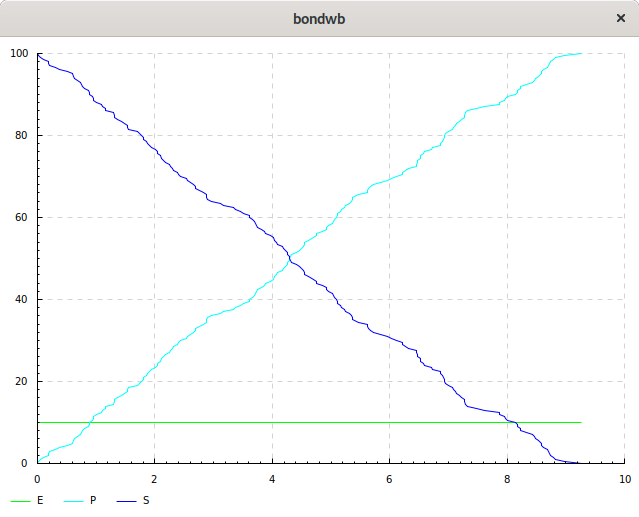

# Bond-Calculus and Continuous Pi

This repository contains two biologically-inspired process calculi, the bond-calculus and the continuous pi-calculus.

## Building

The languages are configured to build using stack in a isolated environment within a Docker image containing all of its dependancies.

This depends only on a working installation of Docker and stack. This is also only known to work on a Linux or OSX (whilst Docker has Windows support, stack's docker integration and graphical output via X11 do not: [stack issue #2421](https://github.com/commercialhaskell/stack/issues/2421)).

Stack can be installed via the command (see [https://docs.haskellstack.org/en/stable/README/](https://docs.haskellstack.org/en/stable/README/)):
```sh

wget -qO- https://get.haskellstack.org/ | sh
```
whilst installation instructions for docker are available at ([https://docs.docker.com/install/](https://docs.docker.com/install/)).

One can build the library and all of its dependencies using the command
```sh

stack build
```

The images is described by ```Dockerfile```; if needed it can be rebuilt via the command:
```sh

docker build -t thomasdwright/bondwb -f Dockerfile .
```

## Running

Once the build is finished the bond-calculus' command line interface, bondwb, can be run via the command:
```sh
stack exec bondwb
```
whilst continuous pi's commandline interface, cpiwb, can be run via the command
```sh
stack exec cpiwb
```

If graphically plot output is required, it can be displayed outside of the container using X11-forwarding, however requires giving the machine access to your display by first running the command:
```bash

xhost +local:root
```

### Using cpiwb

To use cpiwb first run the commands,
```bash
xhost +local:root
stack exec cpiwb
```

This should show the following prompt
```
Welcome to the Continuous Pi-calculus Workbench (CPiWB).
Type "help" for help.

CPiWB:> 
```

Next we will load an example model stored in the file ```models/enzyme.cpi```:
```haskell
species E(e,s)
  = e.0;
species S(e,s)
  = s.(ES(e,s));
species ES(e,s)
  = tau<1>.(E(e,s)|P(e,s));
species P(e,s) = tau<0>.0;

process Pi
   = [100] S(e,s) || [10] E(e,s) || [0] P(e,s) || [0] ES(e,s)
  :{ e-s @ 1 };
```
using the following command:
```
CPiWB:> load models/enzyme.cpi
Loading: models/enzyme.cpi
Done. Type "env" to view.
```
It is now possible to simulate the resulting model (via generating ODEs)  and plot the result using the command,
```
CPiWB:> plot Pi 0 10 100
```
This specifies that we should plot the concentration of each species in the process ```Pi``` from timepoints ```0``` to ```10``` using ```100``` steps, and results in the display of the following plot window:


It is also possible to use the command ```help``` to list all available commands.

### Using bondwb

To use bondwb first run the commands,
```bash
xhost +local:root
stack exec bondwb
```

This should show the following prompt
```
Welcome to the Biological Continuous Pi-calculus Workbench (BioWB).
Type "help" for help.

BioWB:> 
```

Next we will load an example model stored in the file ```models/enzymemm.cpi```:
```haskell
species S = s -> P;

species P = 0;

species E = e -> E;

kinetic law MichaelisMenten(k, K; C, S) = k*C*S/(K + S);

affinity network M(v,k) = {
  e, s at rate MichaelisMenten(v, k);
}

process Pi = [100] S || [10] E with network M(1.1, 2.0);
```
using the following command:
```
BioWB:> load models/enzymemm.biocpi
Loading: models/enzymemm.biocpi
Done. Type "env" to view.
```
It is now possible to simulate the resulting model (via generating ODEs) and plot the result using the command,
```
BioWB:> plot Pi 0 10 100
```
Resulting in the following plot window:


We can also perform a stochastic simulation of the model using [StochPy](http://stochpy.sourceforge.net/)'s implementation of Gillespie's Stochastic Simulation Algorithm:
```
BioWB:> stochpy Pi 0.01 10 "tauleap"
```

This specifies a simulation of process ```Pi``` with the continuous concentrations of the models scaled to discrete variables by a factor ```0.5```, simulated for ```10``` units of time using the ```tauleap``` method (this [can be any method supported by StochPy](http://stochpy.sourceforge.net/html/userguide_doc.html#module-3-stochastic-simulation-algorithm)), resulting in the following plot:


It is also possible to use the command ```help``` to list all available commands.
